# Potato | Share your recipes!

Potato is a browser-based recipe sharing platform. It targets people seeking to find cooking inspiration in other users recipes or share their own. 

Some of the features include being able to create a profile and upload recipes, recipe search functionality and staying up to date with all the recipe creators you enjoy. All this and more while being presented in a fun and simple but elegant manner with quick and easy navigation. 

The live site can be found here: [Potato](https://potato.herokuapp.com/)

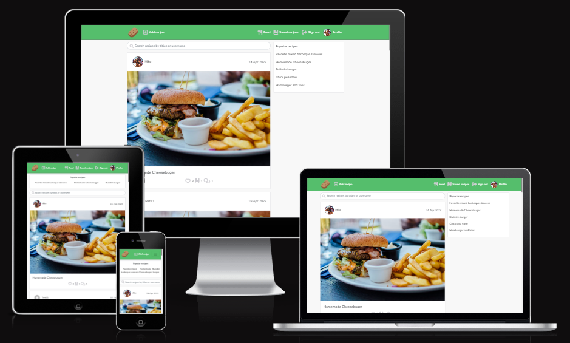

# Table of contents
1. [UX-Design](#ux-design)
    - [Planning](#planning)
        - [Design Thinking](#design-thinking)
        - [Project Goals](#project-goals)
        - [User Stories](#user-stories)
    - [Wireframe](#wireframe)
        - [Style and colors](#style-and-colors)
2. [Technologies Used](#technologies-used)
    - [Languages](#languages)
    - [Frameworks, Libraries, Tools and Programs](#frameworks-libraries-tools-and-programs)
3. [Front-End](#front-end)
4. [Back-End API](#back-end-api)
5. [Features](#features)
    - [Existing Features](#existing-features)
6. [Manual Testing](#manual-testing)
    - [Responsiveness](#responsiveness)
    - [Browser Compability Testing](#browser-compability-testing)
    - [Lighthouse Testing](#lighthouse-testing)
    - [Code Validation](#code-validation)
    - [User Stories Testing](#user-stories-testing)
    - [Bugs](#bugs)
7. [Deployment](#deployment)

# UX-Design
## Planning
### Design thinking
When I began working on this project I tried to put myself in the users position, trying to imagine what a users wants and needs are on a recipe sharing platform. 

I first posed two important questions imagined being answered by a user of the website:
- Why would a user want to use our recipe sharing platform?
    - *To share and discover recipes with other users.*
- What will make them return?
    - *A pleasant and intuitive user experience, featuring actions allowing them to easily interact with other users recipes.*

Examining the answers of these questions, I could follow up with a final question, also imagined being answered by a user: 
- What would be the most important features of a recipe sharing platform?
    - *Easy navigation*
    - *Create and share recipes*
    - *View other users recipes*
    - *Interact with recipes (i.e. like, bookmark, comment)*
    - *Recipe search functionality*
    - *Content presented is relevant to me and my interests and I have the ability to interact and modify it’s relevance*

By posing these three important questions, I got an idea of the key features that needed to be implemented into the project to achieve a users expectations. 

### Project Goals
The goal was to build a pleasant recipe sharing platform that allows users to interact with eachother and their recipes. Key features that needed to be implemented: 
- Quick and easy navigation
- User authentication
- User profiles with avatar, information and recipes
- User can interact through recipes with likes, bookmarks, comments, follows
- CRUD functionality for recipes, likes, bookmarks, comments, followers and profile information
- Content filtering by title, recipe author, followed users recipes, bookmarked recipes

### User stories

#### Navigation
- Site navigation: As a Site user I can view a navigation bar from every page so that I can navigate easily between pages
- Conditional rendering: As a Site user I can see sign in and sign up options when NOT signed in so that I can sign in or sign up for an account
- Routing: As a Site user I can navigate through pages quickly so that I can view content seamlessly without page refresh
- Avatar: As a Site user I can view users avatars so that I can easily identify users of the application

#### Authentication
- Sign up: As a Site user I can create a new account so that I can access all the features for signed up users 
- Sign in: As a Site user I can sign in to the app so that I can access functionality for signed in users 
- Signed in status: As a Site user I can tell if I am signed in or not so that I can sign in/out if I need to 
- Refresh access tokens: As a Site user I can maintain my signed in status until I choose to sign out so that my user experience is not compromised

#### Adding recipes
- Post recipe: As a signed in Site user I can post recipes so that I can share my recipes with other users of the site 
- View a recipe: As a Site user I can view the details of each individual recipe so that I can learn more about it 

#### Recipes page
- View most recently posted recipe: As a Site user I can view all the most recent recipes, ordered by most recently created first so that I am up to date with the newest recipe content 
- Search functionality: As a Site user I can search for recipes with keywords so that I can find the recipes and user profiles I am most interested in
- Popular recipes: As a Site user I can view a list of the most liked recipes so that I can see which recipes are popular 
- View followed profiles: As a signed in Site user I can view recipes filtered by users I follow so that I can keep up to date with their recipes 
- Infinite scroll: As a Site user I can keep scrolling through the recipes on the site, that are loaded for me automatically so that I don’t have to click on “next page” etc

#### Individual recipe page 
- Recipe page: As a Site user I can view a recipes individual page so that I can access the contents and read the comments on that specific recipe
- Edit recipe: As a Recipe owner I can edit the recipe title and content so that I can make corrections or update my recipe after it was created 

#### Commenting on posts
- Create a comment: As a signed in Site user I can add comments to a recipe so that I can share my thoughts about that recipe 
- Comment date: As a Site user I can see how long ago a comment was made so that I know how old a comment is 
- View comments: As a Site user I can read comments on recipes so that I can read what other users think about that recipe 
- Edit comment: As an Owner of a comment I can edit my comment so that I can fix or update my existing comment 
- Delete comment: As an Owner of a comment I can delete my comment so that I can control removal of my comment from the app 

#### Liking recipes
- Like/Unlike a recipe: As a signed in Site user I can like or unlike other profiles recipes so that I can show my support for the recipes that interests me 

#### Saving recipes 
- Save/Unsave a recipe: As a signed in Site user I can save or unsave other profiles recipes so that I can bookmark and save their recipe for future use 

#### Follow users 
- Follow/Unfollow a user: As a signed in Site user I can follow and unfollow other user profiles so that I can see and remove posts by specific users in my recipes feed 

#### Profile page
- Profile page: As a Site user I can view other user profiles so that I can see their recipes and learn more about them
- View saved recipes: As a signed in Site user I can view saved recipes of other user profiles so that I can find the recipes I saved for later use 
- User profile stats: As a Site user I can view stats about a specific user profile: name, nationality, bio, number of recipes, follows and users followed so that I can learn more about them 
- View all recipes by a specific user profile: As a Site user I can view all the recipes by a specific user so that I see their latest recipes or decide to follow them 
- Edit profile: As a signed in Site user I can edit my profile so that I can update my profile information 
- Update username and password: As a signed in Site user I can update my username and password so that I can change my display name an keep my profile secure

## Wireframe
Before building, when planning this website I used the design tool Figma, to create a wireframe of the project. It allowed me to make a basic sketch of what I wanted the the website to look like, what features to include and where to place them. This proved to be very useful as I could base my decisions on the already sketched out wireframe when building the website.

Desktop and mobile layout: 

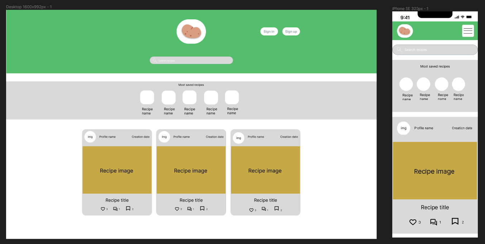

## Style and colors
- Colors
    - When deciding the style of the site, I gathered inspiration from existing recipe sharing platforms. The style I was aiming for was meant to follow the imagined answers (mentionend above) of the platforms users. It needed to be clear, quick and easy to navigate. Therefore, I chose three main colors to build the style on and use consistently thoughout the platform. These three colors are pleasant and contrast each other well, following the concept of clear and easy navigation for the user. 

| Color             | Hex                                                                |
| ----------------- | ------------------------------------------------------------------ |
| Green |  #55be6c |
| Grey |  #555555 |
| White |  #ffffff |

- Fonts
    - The font used in this project is Nunito from [Google Fonts](https://fonts.google.com/). This font followed the inteded theme nicely with its simple and fun aesthetic.

# Technologies Used
## Languages
- HTML
- CSS
- JavaScript

## Frameworks, Libraries, Tools and Programs
- [React](https://17.reactjs.org/) - JavaScript library for building user interfaces.
- [React Bootstrap 4.6](https://react-bootstrap-v4.netlify.app/) - Used for UI components, styles and responsivness.
- [React Router](https://v5.reactrouter.com/web/guides/quick-start) - Used to simplify routing without the need to refresh the page.
- [Axios](https://axios-http.com/docs/intro) - Used to make API requests.
- [React Infinite Scroll](https://www.npmjs.com/package/react-infinite-scroll-component) - Used to load scrolled content automatically without having to click next page etc.
- [JWT Decode](https://jwt.io/) - Used to help decode JSON Web tokens. Prevents a not signed in user from making network requests to refresh tokens.

- [Cloudinary](https://cloudinary.com/) - Used as cloud storage for images. 
- [Google Fonts](https://fonts.google.com/) - Used for platform font.
- [Font Awesome](https://fontawesome.com/) - Used for platform icons.
- [RedKetchup.io](https://redketchup.io/favicon-generator) - Used to help generate platform favicon. 
- [Git](https://git-scm.com/) - Used for version control by utilizing the GitPod terminal to commit to Git and push to GitHub. 
- [GitHub](https://github.com/) - Used to store the project after pushing.
- [Heroku](https://id.heroku.com/login) - Used to deploy project to live environment. 
- [Amiresponsive](https://ui.dev/amiresponsive) -Used to generate mockup imagery to be used in this README.md file. 
- [Figma](https://www.figma.com/) - Design tool used to sketch out a wireframe.

# Front-End
The front-end was built using the React library. 

What is React? 

React is a JavaScript library that aims to simplify development of visual interfaces. Developed at Facebook and released to the world in 2013, it drives some of the most widely used apps, powering Facebook and Instagram among countless other applications. Its primary goal is to make it easy to reason about an interface and its state at any point in time, by dividing the UI into a collection of components. ([Source](https://www.freecodecamp.org/news/the-react-handbook-b71c27b0a795/))

In order to simplify and not focus on the whole website at the same time, you break it down into smaller components that you can reuse wherever you want to. Instead of having a complete website re-render every time something changes, React can update only the things that are different than they were before an event happened. This means that if you, for example, change your profile picture, the image is the only thing that is re-rendered – nothing else on the site is updated and replaced with data that is basically the same as it was before. ([Source](https://www.technigo.io/explained/what-is-react))

React and its concept of reusable components allows for creating flexible applications with fast loading time. 

Several components were created an reused throughout this project: 

- `<Asset />` - A component with several uses. Behaves differently depending on which props are passed: 
    - Animated spinner to display when loading content
    - Image with src and alt attributes
    - Paragraph with message
- `<Avatar />` - Used to display profile images. Examples, this has been reused in the navbar and Recipe page.  
- `<MoreDropdown />` - Used to render dropdown menu, so that a user can edit their profile, recipes and comments. 
- `<Navbar />` - Used to display navigational links and other content, depending on if user is signed in or not. 
- `<NotFound />` - Used to display a 404 'Not found' image and message, reusing the Asset component. 
- `<Recipe />` - Used to render a users recipe. Handles actions to edit, delete, and other users to like and save. Also displays how many likes, saves and comments a recipe has. Examples, this has been reused in the Recipe and Profile pages.
- `<PopularRecipes />` - Used to render the most popular recipes by their likes count. 
- `<CommentCreateForm />` - Displays a comment form on a recipes page and allows user to create a comment. 
- `<Comment />` - Used to display dropdown menu on a users own comments and handles edit and delete functionality. 

# Back-End API

The API for this Front-End application was built with the Django REST Framework. The repository with a README file for the DRF Back-End can be found [here](https://github.com/csilfverskiold/drf-api-potato).

# Features
## Existing features

### Home page
The home page presents the user with various content: 
- Navbar at the top of the page. Its content changes depending on if the user is signed in or not
-  Scrollable page containing recipes posted by users, ordering the most recently created at the top
- Search bar allowing users to search for recipes
- List of popular recipes

Screenshot 1

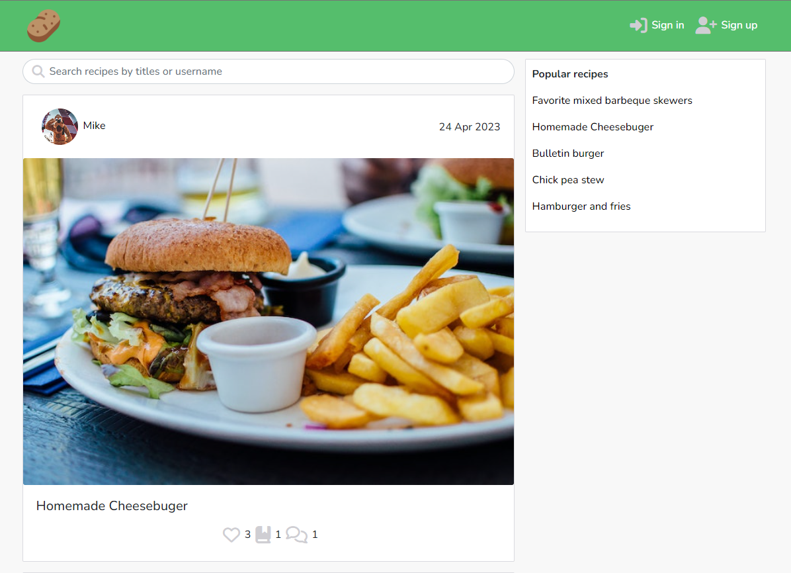

Screenshot 2

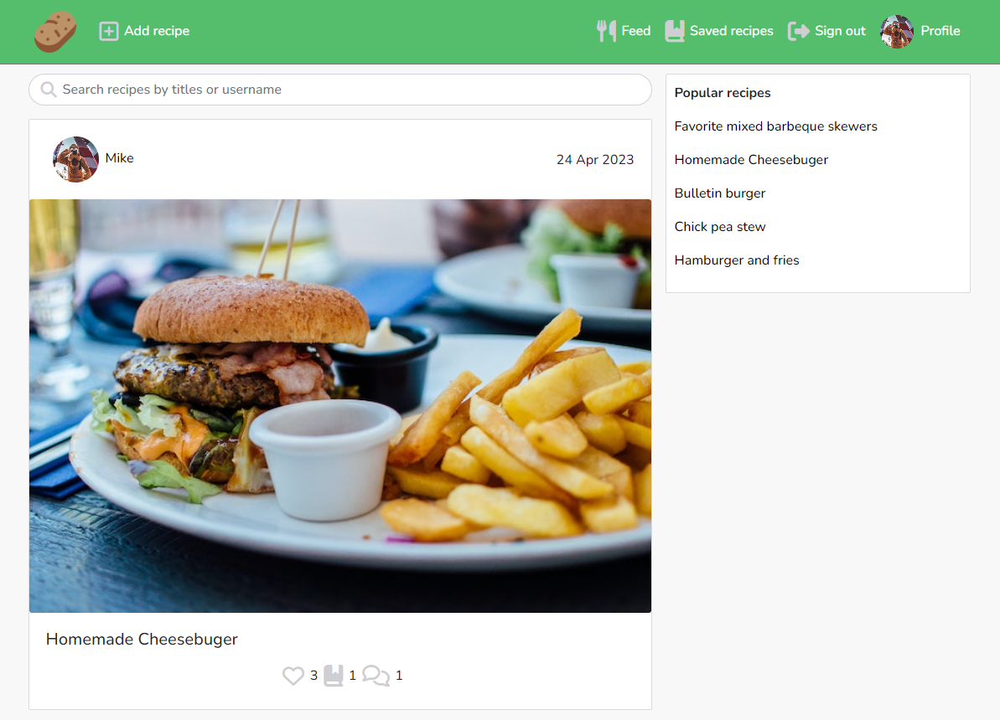

 

### Navbar
The navbar is consistent across all pages of the platform, allowing the user to easily navigate the platform at any time. On smaller screens the the navbar menu collapses under a hamburger menu. Its content changes depending on if the user is signed in or not. 

If a user **is not** signed in, the navbar will provide the user with: 
- Potato logo. Also serves as a link, directing the user to the home page
- Sign up link. Directs user to the Sign up page, where they can create an account
- Sign in link. Directs user to the Sign in page, where the can sign in with their account credentials

If a user **is** signed in, the navbar will provide the user with: 
- Potato logo. Also serves as a link, directing the user to the home page
- Add recipe link. Directs user to create recipe page
- Feed link. Directs user to page with content filtered by users they follow
- Saved recipes link. Directs user to page with saved recipes by other users
- Sign out link. Allows user to sign out and redirects user to home page
- Profile link. Directs user to their own profile page

Screenshot 1

Screenshot 2

 

### Sign up
The Sign up page allows users to create an account, which they can use to sign in with to access all the features of the platform. The user can sign up with a username of their choice (unless already taken), and is required to choose a password for their account aswell. They can then click Sign up and are redirected to the Sign in page, where they can enter their newly created account credentials. If the user already has an account while visiting the Sign up page, they are provided with a Sign in link at the bottom of the form. 

Screenshot

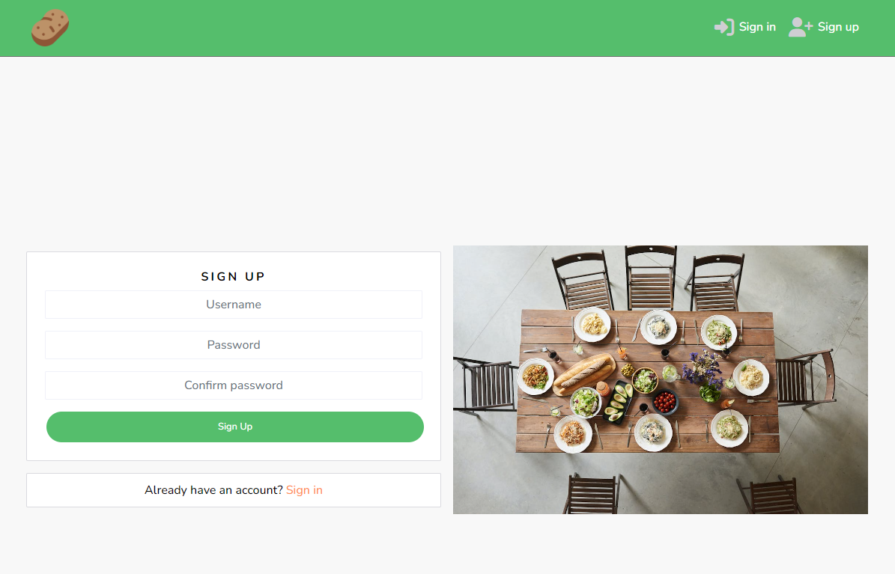

 

### Sign in
The Sign in page lets users sign in with their account credentials. When the user has entered their details and clicked Sign in, they are redirected to the home page. If the user doesn't have an account, they are provided with a Sign up link at the bottom of the form. They can see their status of being signed in reflected in the navbar, where they can see the icon links and Sign out function, only visible if signed in. 

Screenshot

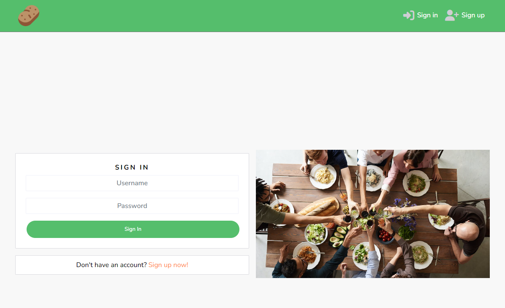

 

### Add recipe
The Add recipe page allows users to create and share recipes for other users to see and interact with. A user can add a recipe with the following content: 
- Image
- Title
- Category
- Ingredients
- Instructions

When the user clicks create, they are redirected to their newly created recipes page.

Screenshot

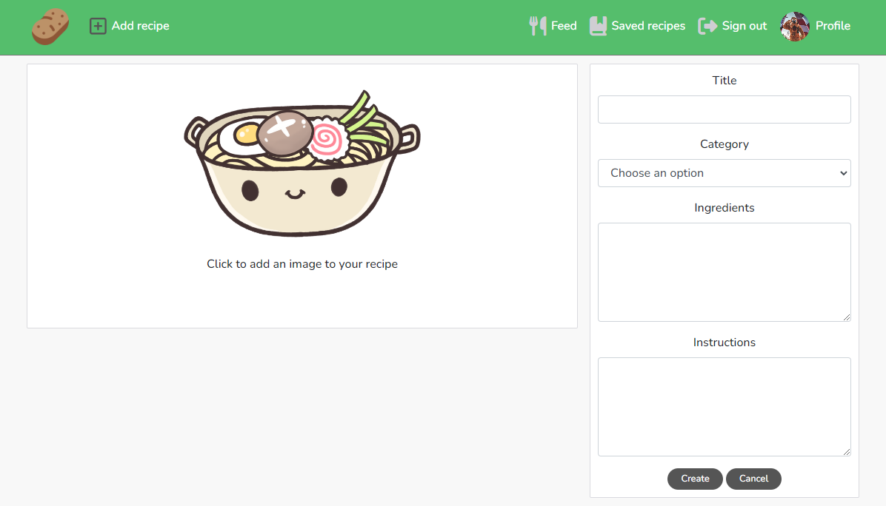

 

### Recipe page
The Recipe page presents the user with all the details of the recipe: 
- Recipe creators username and avatar
- Recipe details (image, title, category, ingredients, instructions)
- Date of creation
- View how many times the recipe has been liked, saved and commented on
- Read comments made on the recipe

Several other functions are also available for a signed in user to interact with depending on if the recipe being viewed is owned by the currently signed in user or someone else. 

If the recipe is owned by **the currently signed in user**, the user can: 
- Edit their recipe
- Comment on their recipe

If the recipe is owned by **another user**, the user can: 
- Show support and 'like' the recipe
- 'Save' the recipe in their Saved recipes page
- 'Comment' on the recipe

Screenshot

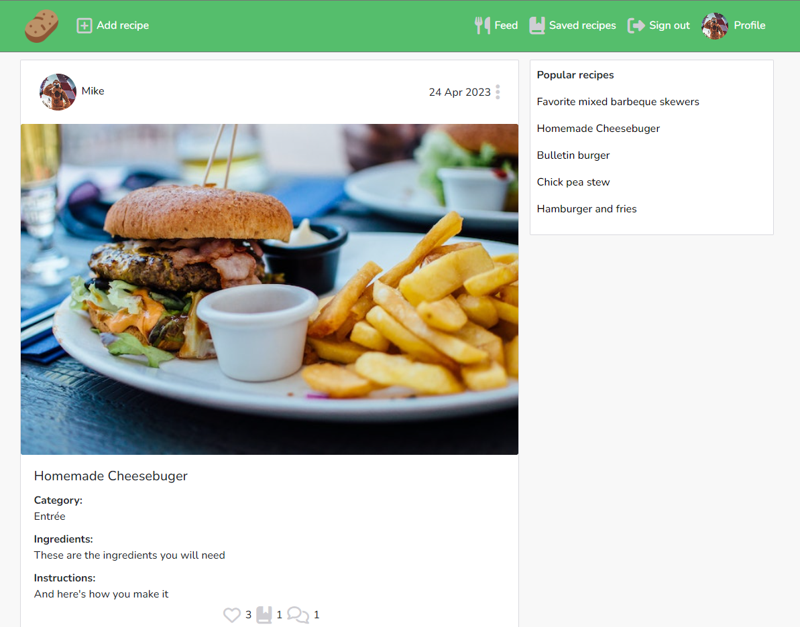

 

### Comment recipe
A signed in user can add comments to interact with their own or other users recipes. On the signed in users own comments, a dropdown menu is presented and which allows them the functionalities to also edit or delete their own comments. 

Screenshot

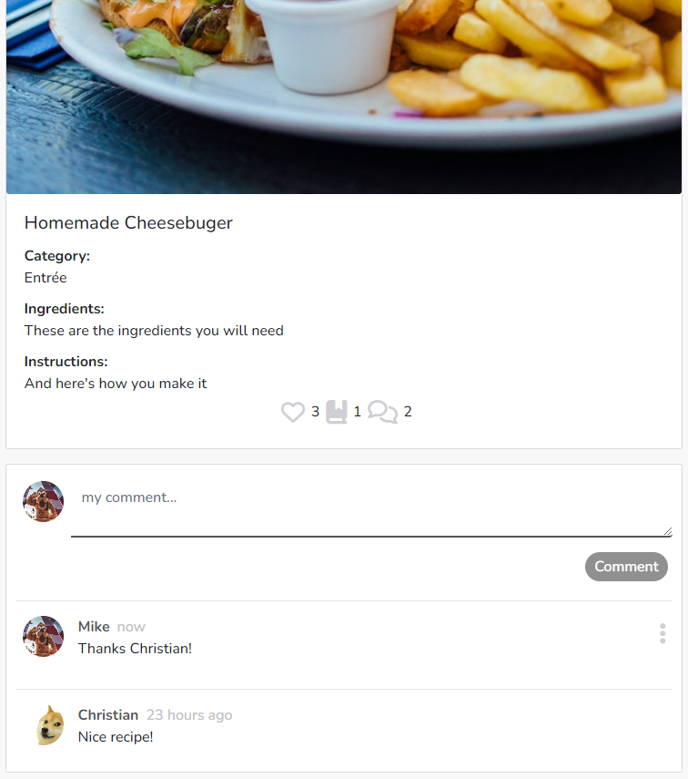

 

### Edit recipe
A signed in user can edit the details of their own recipes. This is accessed by the dropdown menu next to the creation date of their recipe, in the recipe page. When clicking the dropdown menu, the user can choose to edit or delete the recipe. Clicking edit takes them to a page very similar to when adding the recipe, now the fields are prepopulated with previously entered form details. Saving the edited details, will redirect the user back to the recipe page which is now updated with the new details. 

Screenshot

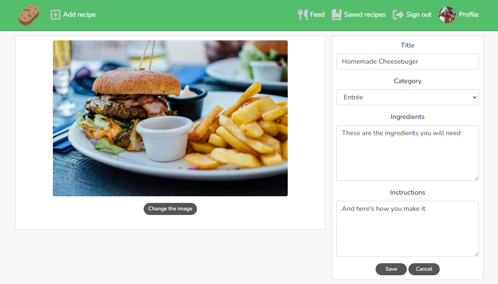

 

### Profile page
The Profile page contains the user details and the created recipes of a user. 
Details presented: 
- Username
- Avatar
- Profile stats (number of recipes created, followers and users followed)
- Nationality (optional)
- Biography (optional)

Profile pages can be accessed by clicking on the username or avatar of a recipe. A signed in user can also access their own profile page from the profile link in the navbar. 

Screenshot

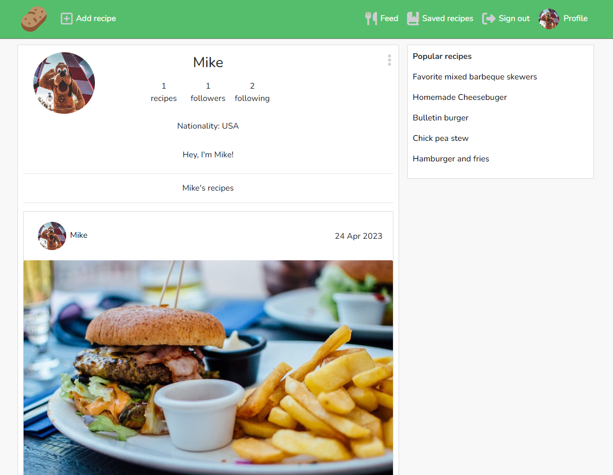

 

### Edit profile
A signed in user can edit their owne profile by clicking the dropdown menu at the top right of their profile page. They are presented with the options: 
- Edit profile
    - Clicking this option allows users to edit their profile avatar, bio and nationality
- Change username
    - Clicking this option allows users to edit their account/profile username
- Change password
    - Clicking this option allows users to edit their account/profile password

Screenshot 1

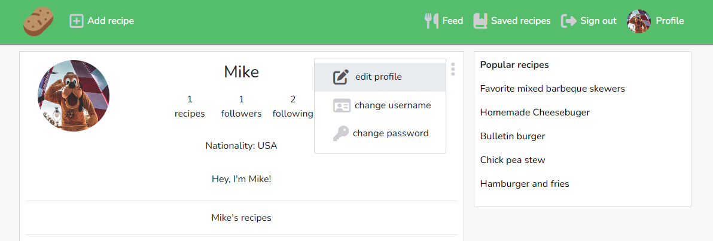

Screenshot 2

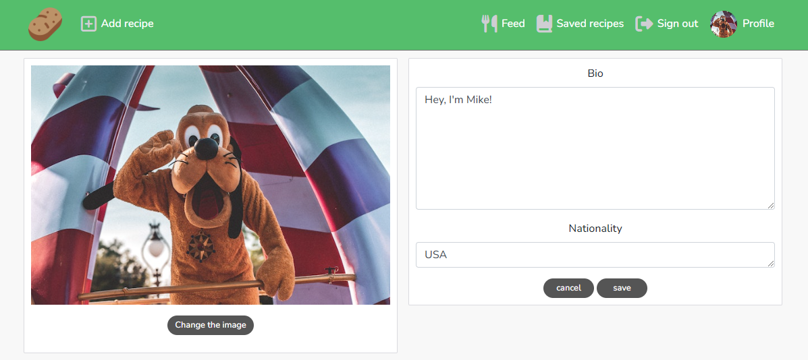

 

### Follow/Unfollow users
When a user is viewing another users profile, they are presented with a 'follow' button in the top right corner of their profile page. If the user wishes to stay up to date with the content of the other profile, they can click the follow button to add the viewed profile to their feed page. The action success is reflected with the follow button changing color and text to 'unfollow' and the viewed profiles 'followers' stats is added by 1, as well as the users profile 'following' stat added by 1. 

Screenshot

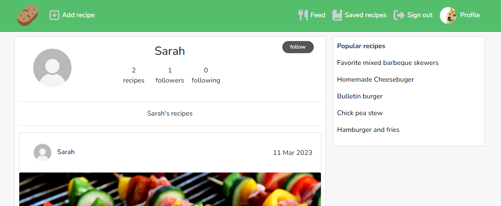

 

### Feed
A signed in user can access their Feed page, via the feed link located in the navbar. The feed page contains filtered content, only displaying recipes created by users the signed in user is following. 

### Saved recipes
The Saved recipes page acts as a bookmarking page, allowing users to save other users recipes for later use. A signed in user can access their saved recipes page, via the saved recipes link located in the navbar. The saved recipes page contains filtered content, only displaying other profiles recipes the signed in user has saved. 

### Search bar
The search bar allows users to filter the recipe content of the current page (home, feed, saved recipes). It filters by searching recipe title or username of recipe creator. The search bar is located just below the navbar. 

### Popular recipes
The Popular recipes displays a short list of the currently most popular recipes across several pages of the platform. In a descending order with the most popular at the top, it displays the most 'liked' recipes. Each recipe in the list is clickable and takes the user to their respective recipe page. Accomodating site real-estate, top three on mobile and top five on desktop. 

Screenshot

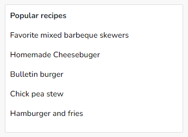

 

### Infinite scroll
This platform features 'infinite scroll', meaning the user can keep scrolling through the recipes one after another, while the content is loaded automatically and no need to click to access the next page. 

### No results
In the case that there is nothing to display, for example a user searches for something in the search bar that doesn't exist on the platform, the user will be notified with 'No results found'. 

Screenshot

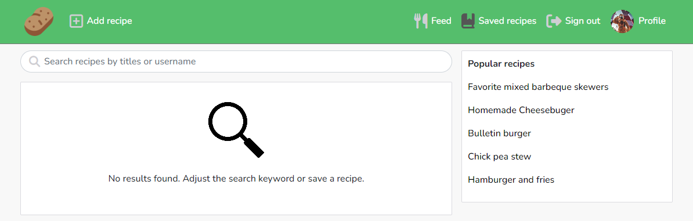

 

# Manual Testing
## Responsiveness
This project was built according to the Mobile First concept, primarily built for small screens first and adapted for larger after. Testing was conducted for responsiveness on small, medium and large screens. Elements in all pages respond as inteded on all devices.

## Browser Compability Testing
I have tested that this website works as intended in browsers: 
- Chrome
- Firefox
- Edge

## Lighthouse Testing
### Accessibility
I confirmed that the colors and fonts chosen are easy to read and accessible by running it through Lighthouse in Chrome DevTools.

Screenshot

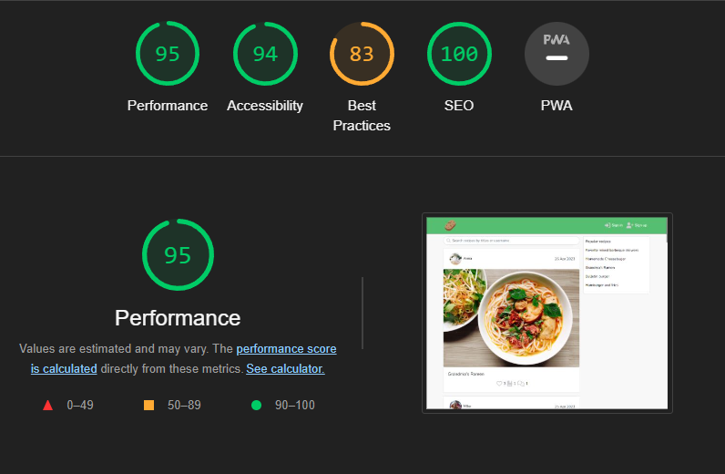

 

However, Lighthouse did not entirely approve of the 401 Unauthorized GET/POST requests being made by a user who is not signed in. This results in the 'Best practices' results to be brought down a little. When a user is signed in, the results are better.  

## Code Validation
The following validators were used to validate the code used in this project:
- [HTML Validator](https://validator.w3.org/#validate_by_uri)
    - Results: All clear, no errors to show.
- [CSS Validator](https://jigsaw.w3.org/css-validator/#validate_by_uri)
    - Results: All clear, no errors to show.

## User Stories Testing
#### Navigation
- Site navigation: As a Site user I can view a navigation bar from every page so that I can navigate easily between pages
    - **Action:** Navigate to any page on the platform
    - **Expectation:** A navbar with navlinks is always visible and available
    - **Result:** Works as intended

- Conditional rendering: As a Site user I can see sign in and sign up options when NOT signed in so that I can sign in or sign up for an account
    - **Action:** User visiting site NOT signed in
    - **Expectation:** Options to sign in/up clearly presented when NOT signed in
    - **Result:** Works as intended
- Routing: As a Site user I can navigate through pages quickly so that I can view content seamlessly without page refresh
    - **Action:** Click on navlinks or directing buttons 
    - **Expectation:** Takes me to the inteded page 
    - **Result:** Works as intended
- Avatar: As a Site user I can view users avatars so that I can easily identify users of the application
    - **Action:** View recipes, profiles and comments
    - **Expectation:** Users avatars are displayed with their owned recipes, profile and comments
    - **Result:** Works as intended

#### Authentication
- Sign up: As a Site user I can create a new account so that I can access all the features for signed up users 
    - **Action:** Navigate to Sign up page through navbar link, enter username/password details, click Sign up
    - **Expectation:** Creates a new account allowing me to sign in with entered username/password details
    - **Result:** Works as intended
- Sign in: As a Site user I can sign in to the app so that I can access functionality for signed in users 
    - **Action:** Navigate to Sign in page through navbar link, enter username/password details, click sign Sign in
    - **Expectation:** Allows user to sign in and access all site functionality
    - **Result:** Works as intended
- Signed in status: As a Site user I can tell if I am signed in or not so that I can sign in/out if I need to 
    - **Action:** Viewing in navbar
    - **Expectation:** Signed in/out status is reflected to the user in the navbar, rendering user with Sign in/out options
    - **Result:** Works as intended
- Refresh access tokens: As a Site user I can maintain my signed in status until I choose to sign out so that my user experience is not compromised
    - **Action:** Sign in to platform and do not sign out within 24h
    - **Expectation:** Users stays signed in for 24h, unless actively signing out before then
    - **Result:** Works as intended

#### Adding recipes
- Post recipe: As a signed in Site user I can post recipes so that I can share my recipes with other users of the site 
    - **Action:** Navigate to Add recipe page through navbar link
    - **Expectation:** Add recipe form is presented allowing me to create a recipe with image and detials
    - **Result:** Works as intended
- View a recipe: As a Site user I can view the details of each individual recipe so that I can learn more about it 
    - **Action:** Click on the image of a recipe
    - **Expectation:** Takes me to the recipes page and displays all of its details
    - **Result:** Works as intended

#### Recipes page
- View most recently posted recipe: As a Site user I can view all the most recent recipes, ordered by most recently created first so that I am up to date with the newest recipe content 
    - **Action:** Navigate to home page (Potato logo in navbar)
    - **Expectation:** View all the most recent recipes, ordered by most recently created from the top
    - **Result:** Works as intended
- Search functionality: As a Site user I can search for recipes with keywords so that I can find the recipes and user profiles I am most interested in
    - **Action:** Navigate to search bar (below navbar), enter keywords i.e. "burger"
    - **Expectation:** All recipes with "burger" in title or username will be filtered and displayed
    - **Result:** Works as intended
- Popular recipes: As a Site user I can view a list of the most liked recipes so that I can see which recipes are popular 
    - **Action:** View Home, Recipe, Feed, Saved recipes, Profile pages
    - **Expectation:** List of popular recipes displayed, ordered by most liked 
    - **Result:** Works as intended
- View followed profiles: As a signed in Site user I can view recipes filtered by users I follow so that I can keep up to date with their recipes 
    - **Action:** Navigate to Feed page
    - **Expectation:** Only display recipes by user I actively follow
    - **Result:** Works as intended
- Infinite scroll: As a Site user I can keep scrolling through the recipes on the site, that are loaded for me automatically so that I don’t have to click on “next page” etc
    - **Action:** Scroll through the content of the platform
    - **Expectation:** Content is automatically loaded for me and I don't have to click to get to another page of content
    - **Result:** Works as intended

#### Individual recipe page 
- Recipe page: As a Site user I can view a recipes individual page so that I can access the contents and read the comments on that specific recipe
    - **Action:** Click on the image of a recipe
    - **Expectation:** Takes me to the recipes page and displays its details and comments
    - **Result:** Works as intended
- Edit recipe: As a Recipe owner I can edit the recipe title and content so that I can make corrections or update my recipe after it was created 
    - **Action:** Navigate to the page of a recipe you own, click dropdown menu and select icon to edit or delete recipe
    - **Expectation:** Edit allows me to update the content and Delete allows me to delete the recipe
    - **Result:** Works as intended

#### Commenting on posts
- Create a comment: As a signed in Site user I can add comments to a recipe so that I can share my thoughts about that recipe 
    - **Action:** Navigate to the page of a recipe, find comment form at below the recipe content, enter a comment and click Comment
    - **Expectation:** Adds a comment to a recipes page
    - **Result:** Works as intended
- Comment date: As a Site user I can see how long ago a comment was made so that I know how old a comment is 
    - **Action:** View comment section of a recipe page
    - **Expectation:** Days/time since comment was created is displayed
    - **Result:** Works as intended
- View comments: As a Site user I can read comments on recipes so that I can read what other users think about that recipe 
    - **Action:** View comment section of a recipe page
    - **Expectation:** Comments made on the recipe are displayed, most recently created at the top
    - **Result:** Works as intended
- Edit comment: As an Owner of a comment I can edit my comment so that I can fix or update my existing comment 
    - **Action:** Navigate to and click on dropdown menu of a comment you own, select Edit icon
    - **Expectation:** Edit icon allows me to update my comment
    - **Result:** Works as intended
- Delete comment: As an Owner of a comment I can delete my comment so that I can control removal of my comment from the app 
    - **Action:** Navigate to and click on dropdown menu of a comment you own, select Delete icon
    - **Expectation:** Delete icon allows me to delete my comment
    - **Result:** Works as intended

#### Liking recipes
- Like/Unlike a recipe: As a signed in Site user I can like or unlike other profiles recipes so that I can show my support for the recipes that interests me 
    - **Action:** Click the like (heart) icon on a recipe to 'like' it, click it again to 'unlike' it
    - **Expectation:** Liking the recipe is reflected by the icon changing color to red and the likes count to add +1. Unliking is the same but reverse, color changes back to grey and likes count subtracts -1
    - **Result:** Works as intended

#### Saving recipes 
- Save/Unsave a recipe: As a signed in Site user I can save or unsave other profiles recipes so that I can bookmark and save their recipe for future use 
    - **Action:** Click the save (book) icon on a recipe to 'save' it, click it again to 'unsave' it
    - **Expectation:** Saving the recipe is reflected by the icon changing color to green and the saves count to add +1. The recipe is also added to my Saved recipes page. Unsaving is the same but reverse, color changes back to grey and saves count subtracts -1
    - **Result:** Works as intended

#### Follow users 
- Follow/Unfollow a user: As a signed in Site user I can follow and unfollow other user profiles so that I can see and remove posts by specific users in my recipes feed 
    - **Action:** Navigate to a profiles page, click follow button to 'follow' and unfollow button to 'unfollow' a profile. 
    - **Expectation:** When following a profile, their created recipes are displayed in your Feed page. When unfollowing a profile, their created recipes are removed and no longer displayed in your Feed page. 
    - **Result:** Works as intended

#### Profile page
- Profile page: As a Site user I can view other user profiles so that I can see their recipes and learn more about them
    - **Action:** Click in a users name or avatar
    - **Expectation:** Takes me to the users profile page and displays their avatar, name, stats, details and recipes
    - **Result:** Works as intended
- View saved recipes: As a signed in Site user I can view saved recipes of other user profiles so that I can find the recipes I saved for later use 
    - **Action:** Navigate to Saved recipes page through navbar link
    - **Expectation:** Displays only recipes I have actively clicked the save icon on
    - **Result:** Works as intended
- User profile stats: As a Site user I can view stats about a specific user profile: name, nationality, bio, number of recipes, follows and users followed so that I can learn more about them 
    - **Action:** Viewing a users profile page
    - **Expectation:** Displays their avatar, name, stats and details
    - **Result:** Works as intended
- View all recipes by a specific user profile: As a Site user I can view all the recipes by a specific user so that I see their latest recipes or decide to follow them 
    - **Action:** Viewing a users recipes in their profile page
    - **Expectation:** Scroll down below the users stats and details to view their created recipes. If I want to follow them, click the follow button in the top of their profile page
    - **Result:** Works as intended
- Edit profile: As a signed in Site user I can edit my profile so that I can update my profile information 
    - **Action:** Navigate to my Profile page through navbar link, click dropdown menu at the top of my profile page and select Edit profile
    - **Expectation:** Takes me to an editing page where I can edit my avatar, bio and nationality
    - **Result:** Works as intended
- Update username and password: As a signed in Site user I can update my username and password so that I can change my display name an keep my profile secure
    - **Action:** Navigate to my Profile page through navbar link, click dropdown menu at the top of my profile page and select Change username or Change password options
    - **Expectation:** Takes me to an editing page where I can change my username or password
    - **Result:** Works as intended

## Bugs
### Resolved and unresolved
#### Resolved
- In /api/axiosDefaults.js > Wrong url in axios.defaults.baseURL caused bug not allowing access to drf-api. 
    - Solution: Fixed by editing and adding correct url. 
- In PopularRecipes.js > Warning in console due to recipe.id key property being placed in an 'a tag', inside a 'p tag'. 
    - Solution: Fixed by moving recipe.id key property from 'a tag' to 'p tag'. 

#### Unresolved
- No unresolved bugs.

# Deployment
This project was deployed through Heroku using the following steps:
#### **Creating Heroku App**
- Log into Heroku
- Select 'Create New App' from your dashboard
- Choose an app name (if there has been an app made with that name, you will be informed and will need to choose an alternative)
- Select the appropriate region based on your location
- Click 'Create App'

**Connecting to GitHub**
- From the dashboard, click the 'Deploy' tab towards the top of the screen
- From here, locate 'Deployment Method' and choose 'GitHub'
- From the search bar newly appeared, locate your repository by name
- When you have located the correct repository, click 'Connect'
- Locate 'Manual deploy' section towards the bottom of the page
- Select branch and click 'Deploy Branch' and wait until build finished
- Locate and click 'Open app' in top of the app dashboard